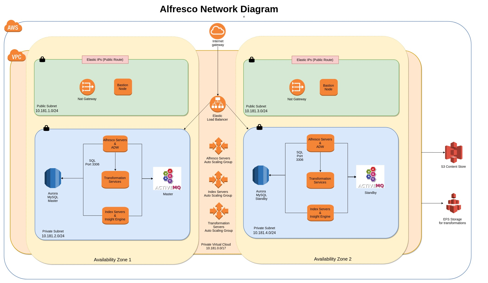

# Deploying ACS Enterprise 6.1 on AWS with Packer and Terraform

## Project Objective
This project is a POC for the deployment of ACS (Alfresco Content Services) 6.1 Enterprise on AWS. The deployment consists of two mayor steps:

- Building AWS AMIs (Amazon Machine Images) containing a base installation of ACS 6.1 Enterprise
- Building AWS infrastructure (VPC, ELB, RDS, etc) and deploying ACS 6.1 Enterprise to it

Please make sure your Alfresco license subscription entitles you to install and run ACS 6.1 Enterprise and Alfresco Search Services with Insight Engine.

The final ACS architecture looks like this:

## Disclaimer
The tools and code used in this blog to deploy ACS 6.1 Enterprise are not officially supported by Alfresco. They are used as a POC to show you how you can use OpenSource tools to deploy and configure resources and applications to AWS in an automated way.

The software used to build and deploy ACS 6.1 Enterprise is available in a public repository in [GitHub](https://github.com/miguel-rodriguez/acs-61-deployment).

## Software requirements
The following software is required to create and deploy resources in AWS:

- [Packer](https://www.packer.io) - used to automate the creation of AMIs.
- [Terraform](https://www.terraform) - used to create and update infrastructure resources.
- [Ansible](https://www.ansible.com/) - Ansible is an IT automation tool used to deploy and configure systems.
- [AWS CLI](https://aws.amazon.com/cli/) - The AWS Command Line Interface (CLI) is a unified tool to manage your AWS services.

Make sure these tools have been installed on the computer you are using to build and deploy ACS 6.1 Enterprise.

## Authenticating to AWS
Both Packer and Terraform need to authenticate to AWS in order to create resources. Since we are creating a large number of infrastructure resources, the user we authenticate with to AWS, needs to have administrator access.

There are multiple ways to configure AWS credentials for Packer and Terraform, the following links will show you how to do it:

- Packer - https://www.packer.io/docs/builders/amazon.html
- Terraform - https://www.terraform.io/docs/providers/aws/index.html

Note: Whatever method you use make sure you keep your AWS credentials private and secure at all times.

## Authenticating to Nexus
Nexus is a repository manager used by Alfresco to publish software artifacts. Packer will connect to Nexus repository to download the necessary software to install ACS 6.1 Enterprise.

Alfresco Enterprise customers have Nexus credentials as part of their license subscription. Please refer to your CRM if you don't know or have your Nexus credentials.

## Building AWS AMIs
The first step to deploy ACS 6.1 Enterprise is to build two types of AMIs:

- Repository AMI - containing Alfresco Repository, Share and ADW (Alfresco Digital Workspace)
- Search Services AMI - containing Alfresco Repository and Search Services with Insight Engine.

#### Repository AMI
For this process we use Packer and Ansible. We first export the "nexus_user" and "nexus_password" environment variables containing credentials to access the Nexus repository. These are stored in the ~/.nexus-cfg file contains the following.

>export nexus_user=xxxxxxxxx  
>export nexus_password=xxxxxxxxx

Note that the .nexus-cfg file is in the user home folder, keep this file and its contents private and secured at all times.

If you want to include custom amps add them to the amps and amps_share folder and they will be deployed to the AMI.

For custom jar files add them to the modules/platform and modules/share folders.

The repository Packer deployment expects to have the `digital-workspace.war` file in the `acs-61-files/downloaded` folder since this fine is not available in Nexus yet. Please place the file there before building the repo image or comment out the task in the `ansible\alfresco-instance.yaml` file.

We can now execute packer by calling the build_61_AMI.sh script.

>cd acs-61-repo-aws-packer  
>./build_61_AMI.sh

This shell script will load the nexus environment variables and call packer build using a template file for the provisioning of the AMI and a variables file containing deployment specific information such as your default VPC Id, the AWS region, etc.

Make sure you change the value of the vpc_id variable to use your default VPC Id.

#### Search Services AMI
As on the previous section, we use Packer and Ansible to create a Search Services AMI.

Make sure you change the value of the vpc_id variable to your default VPC Id before running the build_61_AMI.sh script.

>cd acs-61-repo-aws-packer  
>./build_61_AMI.sh

As the script runs you can see what is is doing during its execution...

>▶ ./build_61_AMI.sh  
amazon-ebs output will be in this color.  
==> amazon-ebs: Prevalidating AMI Name: acs-61-repo-1557828971  
amazon-ebs: Found Image ID: ami-00846a67  
==> amazon-ebs: Creating temporary keypair: packer_5cda956b-bd62-1d09-cef2-639152741025  
==> amazon-ebs: Creating temporary security group for this instance: packer_5cda956b-345b-2321-afd5-40b1b06a6bc1  
==> amazon-ebs: Authorizing access to port 22 from 0.0.0.0/0 in the temporary security group...  
==> amazon-ebs: Launching a source AWS instance...  
==> amazon-ebs: Adding tags to source instance  
amazon-ebs: Adding tag: "Name": "Packer Builder"  
amazon-ebs: Instance ID: i-0f80505eb56dccbb7  
==> amazon-ebs: Waiting for instance (i-0f80505eb56dccbb7) to become ready...  

On completion the script will output the AMI id of the newly created AMI. Keep track of both AMI Ids, as we will need to use them in the Terraform script next.

>Build 'amazon-ebs' finished.  
>==> Builds finished. The artifacts of successful builds are:  
--> amazon-ebs: AMIs were created:  
eu-west-2: ami-08fd6196500dbcb01  

## Building the AWS Infrastructure and Deploying ACS 6.1 Enterprise
Now that we have created both the Repository and the Search Services AMIs we can start building the AWS infrastructure and deploy ACS 6.1 Enterprise

In the acs-61-aws-terraform folder we have the terraform.tfvars containing configuration specific for the AWS and ACS deployments.

Some of the variables that will need to be updated are:

- resource-prefix - this is used to name all resources created with some initials to identify the resources belonging to this deployment.
- aws-region
- aws-availability-zones
- vpc-cidr
- autoscaling-group-key-name
- s3-bucket-location

and of course we need to set the auto scaling image id with the newly generated AMIs

- autoscaling-repo-group-image-id
- autoscaling-solr-group-image-id

Once the configuration has been set we are ready to start building the solution. We first need initialize terraform with the "terraform init" command:

> ▶ terraform init
>  Initializing modules...
>  - module.vpc
>  - module.rds
>  - module.alfresco-repo
>  - module.alfresco-solr
>  - module.bastion
>  - module.alb
>  - module.internal-nlb
>  - module.activemq
>  Initializing provider plugins...
>  
>  The following providers do not have any version constraints in configuration,
>  so the latest version was installed.
>  
>  To prevent automatic upgrades to new major versions that may contain breaking
>  changes, it is recommended to add version = "..." constraints to the
>  corresponding provider blocks in configuration, with the constraint strings
>  suggested below.
>  
>  * provider.aws: version = "~> 2.10"
>  
>  Terraform has been successfully initialized!
>  
>  You may now begin working with Terraform. Try running "terraform plan" to see
>  any changes that are required for your infrastructure. All Terraform commands
>  should now work.
>  
>  If you ever set or change modules or backend configuration for Terraform,
>  rerun this command to reinitialize your working directory. If you forget, other
>  commands will detect it and remind you to do so if necessary.

We can now issue the apply command to start the build. Upon completion (it will take around 15 minutes) we will get notification of the URLs available to connect to Alfresco.

> Apply complete! Resources: 51 added, 0 changed, 0 destroyed.
> 
> Outputs:
> 
> Alfresco Digital Workspace = http://acs-61-alb-1503842282.eu-west-2.elb.amazonaws.com/digital-workspace  
> Alfresco Share = http://acs-61-alb-1503842282.eu-west-2.elb.amazonaws.com/share  
> Alfresco Solr = http://acs-61-alb-1503842282.eu-west-2.elb.amazonaws.com/solr  
> Alfresco Zeppelin = http://acs-61-alb-1503842282.eu-west-2.elb.amazonaws.com/zeppelin  
> RDS Endpoint = acs-61-db.cmftgvbzqrto.eu-west-2.rds.amazonaws.com:3306  
> VPC ID = vpc-006f0c6354656e96d5c> 

To destroy the resources issue a "terraform destroy" command.

> Terraform will perform the following actions:
> .......
> 
> Plan: 0 to add, 0 to change, 51 to destroy.
> 
> Do you really want to destroy all resources?
> Terraform will destroy all your managed infrastructure, as shown above.
> There is no undo. Only 'yes' will be accepted to confirm.

## To do list
There are a couple of things to add to this project:

- CI/CD scripts - I have already implemented this and will document it accordingly.
- On the Search Services instances we should download a backup of the Solr indexes when starting a new instance instead of building the indexes from scratch.

